# ORGSTRUCTURE-PROJECT

**OrgStructure** — это комплексная платформа для упрощения управления справочной информации и визуализации организационной структуры предприятия. Проект состоит из трех ключевых компонентов:

1. **Клиентская часть (Front-End)** — пользовательский интерфейс, обеспечивающий взаимодействие с системой.
2. **Серверная часть (Back-End)** — серверное приложение, отвечающее за бизнес-логику и обработку данных.
3. **Расширение (Extension)** — браузерное расширение, дополняющее функционал платформы.

---

## **Описание функционала**

- **Клиентская часть**:
  - Визуализация организационных структур.
  - Удобный интерфейс для создания, редактирования и просмотра данных.
  
- **Серверная часть**:
  - API для обработки данных организационных структур.
  - Авторизация и аутентификация.
  - Работа с базой данных.

- **Расширение**:
  - Быстрый доступ к основным функциям платформы через браузер.
  - Интеграция с клиентской частью.

---

  <a href="./public/screenshots/1.png" target="_blank">
    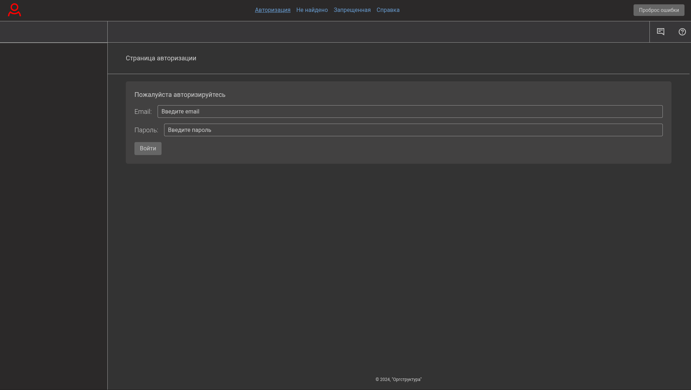
  </a>
  <a href="./public/screenshots/2.png" target="_blank">
    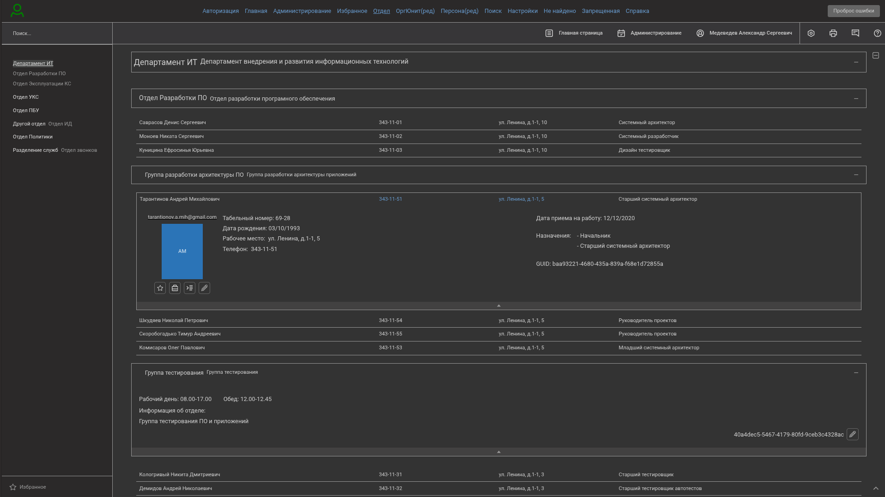
  </a>
  <a href="./public/screenshots/3.png" target="_blank">
    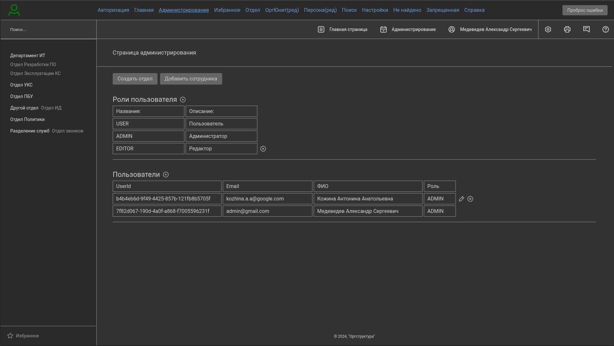
  </a>
  <a href="./public/screenshots/4.png" target="_blank">
    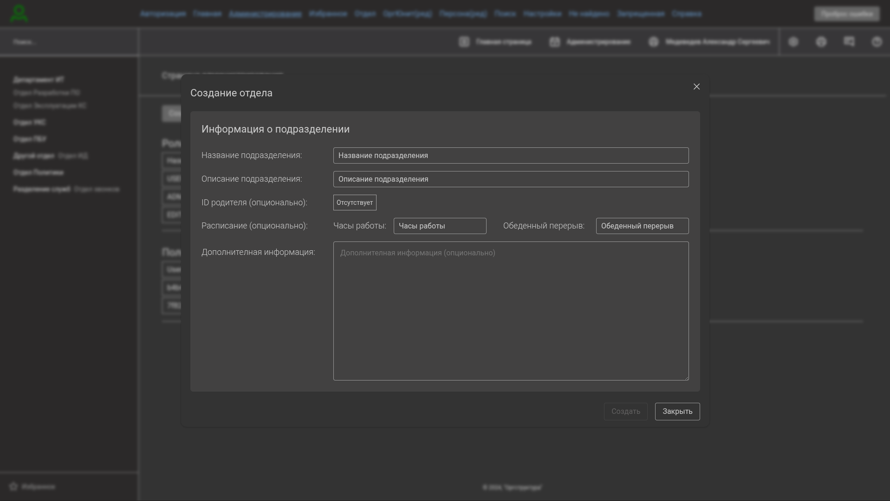
  </a>
  <a href="./public/screenshots/5.png" target="_blank">
    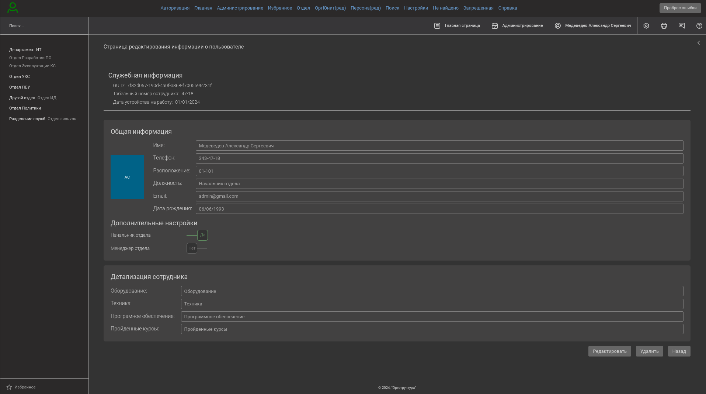
  </a>
  <a href="./public/screenshots/6.png" target="_blank">
    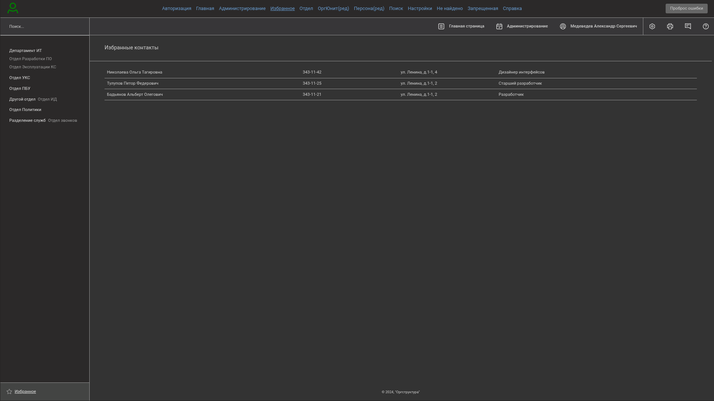
  </a>
    <a href="./public/screenshots/7.png" target="_blank">
    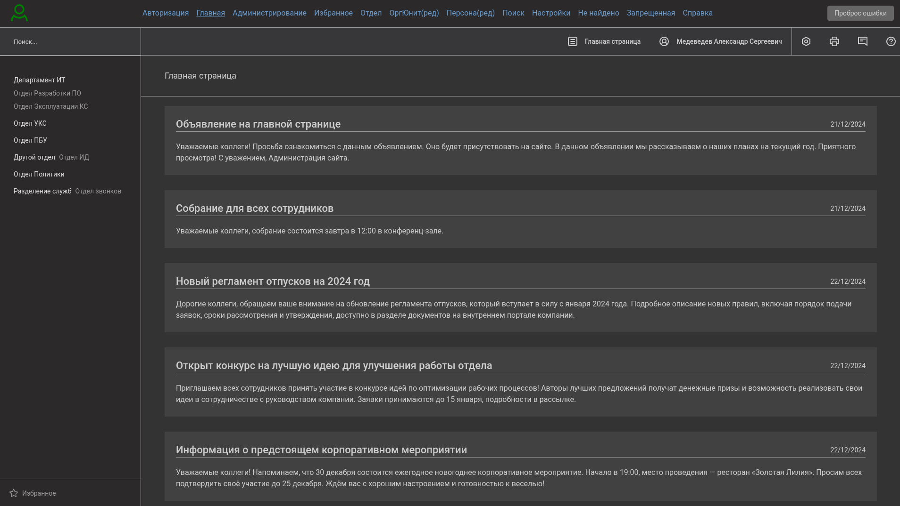
  </a>
    </a>
    <a href="./public/screenshots/8.png" target="_blank">
    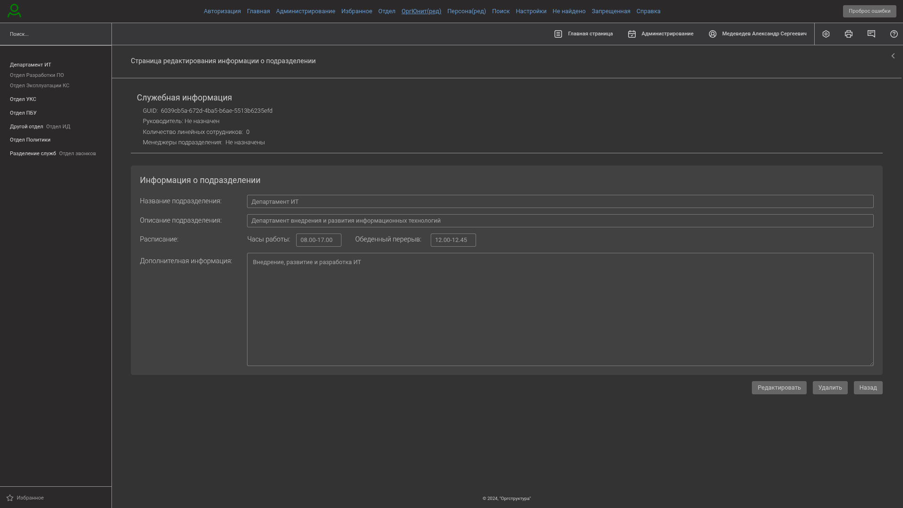
  </a>
    </a>
    <a href="./public/screenshots/9.png" target="_blank">
    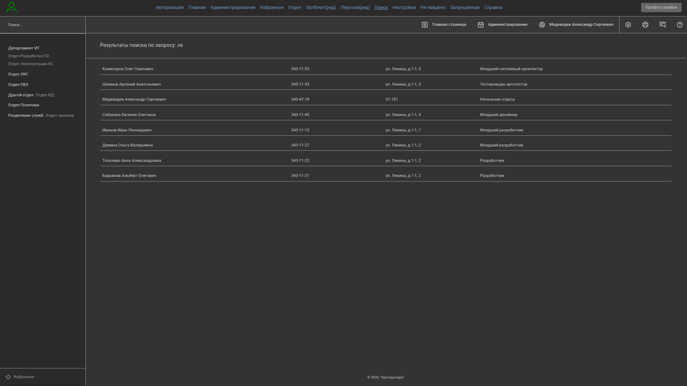
  </a>
    </a>
    <a href="./public/screenshots/10.png" target="_blank">
    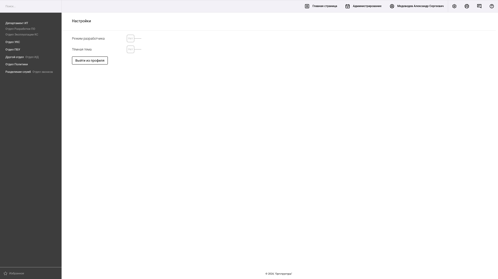
  </a>
    </a>
    <a href="./public/screenshots/11.png" target="_blank">
    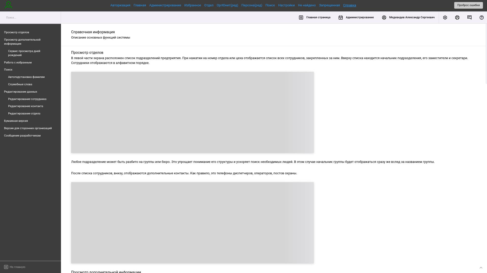
  </a>

---

## **Архитектура проекта**

Проект состоит из трех основных частей:

1. **Клиентская часть (client)** — пользовательский интерфейс, построенный с использованием React и TypeScript.
2. **Серверная часть (server)** — API и бизнес-логика, реализованные на TypeScriptб, Nest.js, Sequelize и PosgreSQL .
3. **Браузерное расширение (extension)** — расширение для браузера, для администраторского взаимодействия с платформой.

---